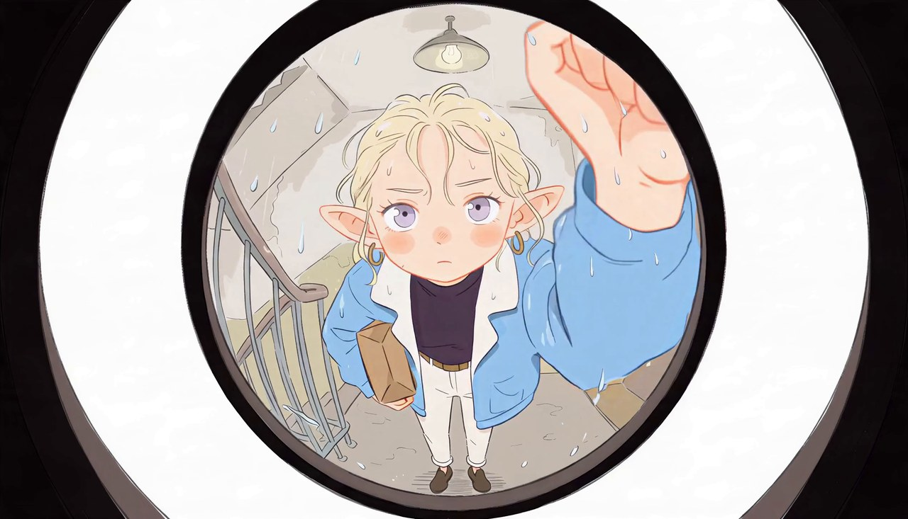
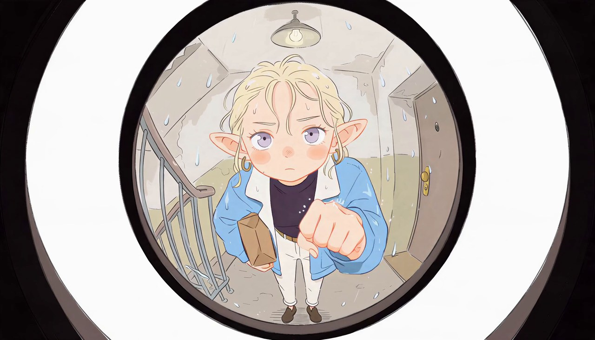
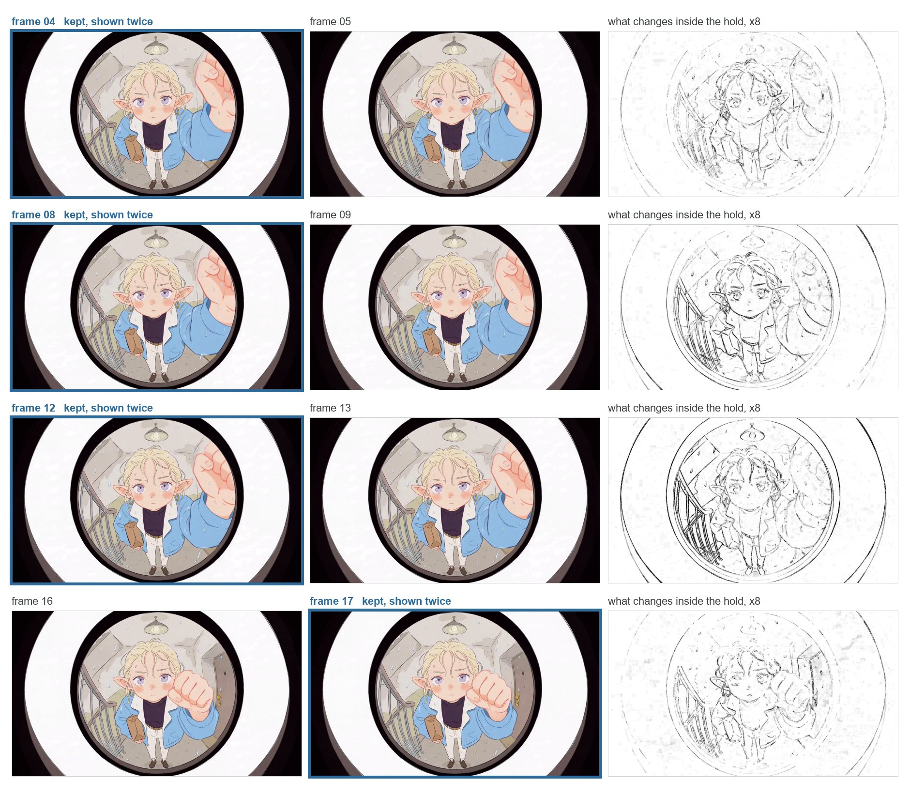
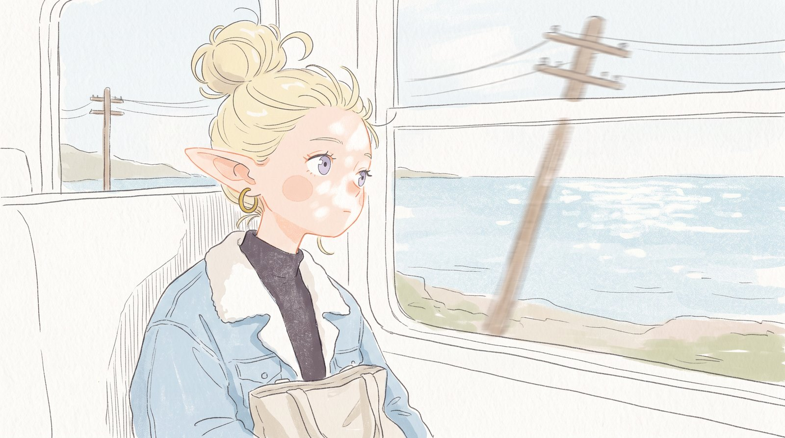
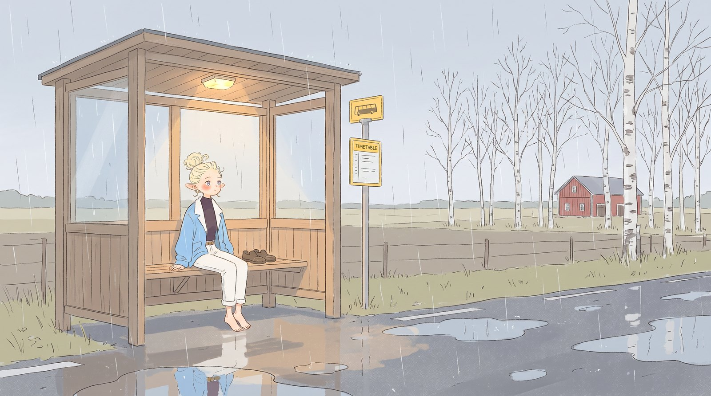
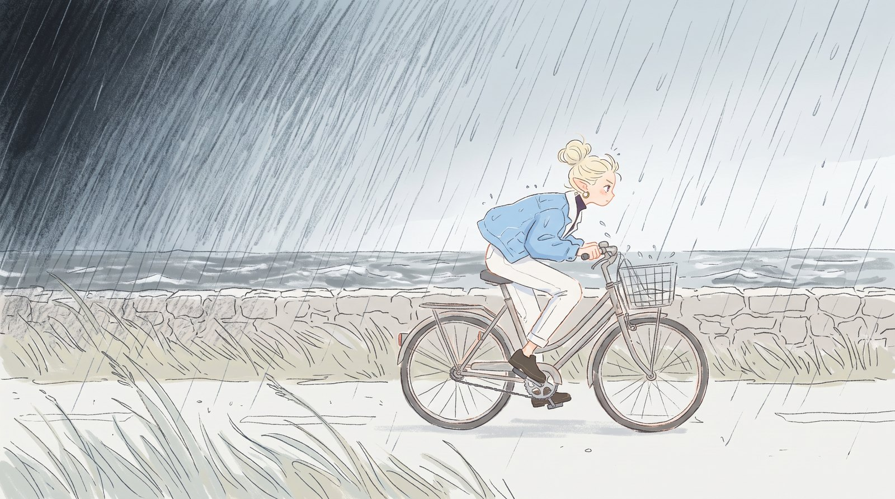
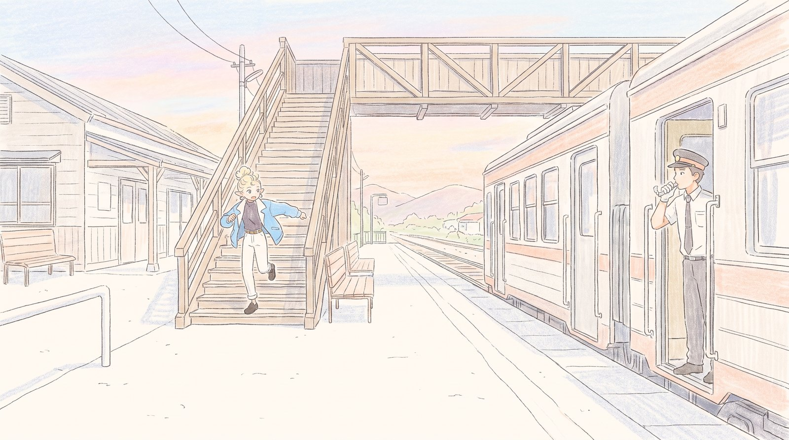
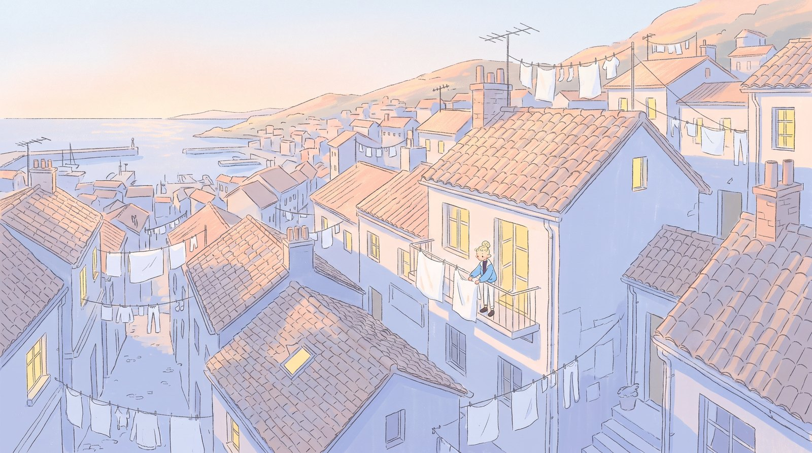
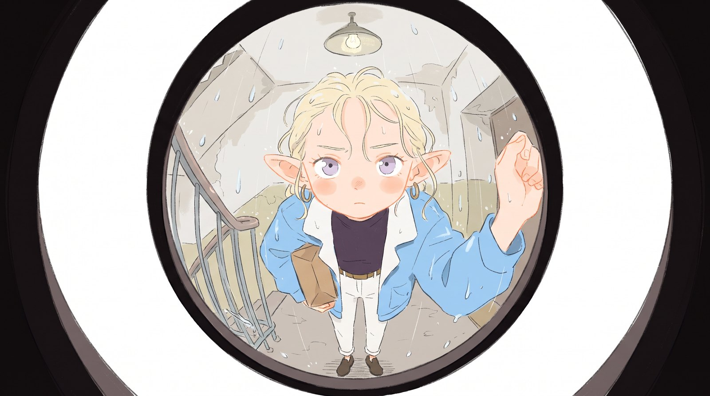

# Full-shot anime generation: which video models move convincingly, and a one-second repair

*Anime can now be generated a whole shot at a time, scene and motion together, from a single first frame. We compared seven video routes on six shots to find the ones that move convincingly with little work from an artist on the in-betweens, then regenerated one second of a failed take with our seq adapter.*

**Alvdansen Labs** · Minta Carlson, Timothy Bielec · October 2026

This study is about generating anime one full shot at a time. Each shot begins from one generated frame, with no layers and no line art. A video model renders the whole scene from it: character, background and motion together. What we set out to find is
which models move convincingly in this style with little direct work from an artist on
the in-betweens, the drawings that carry a movement from one pose to the next. Anime usually holds each of those drawings for two
frames, a rhythm called twos, which gives twelve drawings to every second of screen. Keeping that cadence, and keeping the motion
believable, is what we judged every take on.

Some teams want methods built deliberately into a multi-stage animation pipeline, where an artist draws the keys and
adapters trained on hand-drawn animation fill in the drawings around them. Our paper [Animating on Twos](https://alvdansen.github.io/animating-on-twos/) covers that approach. This case study is
written for AI-native teams. It stays with shots generated whole, on tools a studio can open today, and asks how well each route
keeps the cadence and the believability of the motion.

We gave seven routes the same character and the same six first frames, which we generated with Google's Nano Banana
image models, working from hand-drawn references. A route here is a model together with the way it is run. Every route ran as a ComfyUI workflow on Floyo:
ComfyUI is the node-graph tool in which most open video pipelines are built, and Floyo runs ComfyUI workflows in the cloud. The
seven routes are:

- Four commercial models called through Floyo's partner nodes: MiniMax H3 API, Seedance 2.5, FLUX 3 and Wan 3.0
- MiniMax H3, run from its open weights
- Two adapters we trained on top of those weights, the seq adapter and the hero adapter

Each route animated each first frame twice, into a 5-second shot. We graded every take by eye and measured every take frame by frame. Then we set out to repair one take that
went wrong. Its knock was meant for the door and hits the peephole lens. We regenerated that second with our seq adapter as a tween to cut back into the take.

## What we found

Five findings came out of the study, the first four from the comparison and the fifth from the repair:

1. **[The drawing holds before the motion does.](#1-the-drawing-holds-before-the-motion-does)** Nearly every take looked hand-drawn. What separated the usable ones was
   motion: timing, contact, and movement the shot gives no reason for.
2. **[Each route fails differently, and the kind of failure decides the fix.](#2-each-route-fails-differently)** The four routes we found smoothest do not
   line up from best to worst. Each tends toward a different kind of failure, and each kind has a different repair.
3. **[Two attempts that agree may show the model's bias. Agreement alone does not show control.](#3-agreement-between-attempts-can-be-the-models-bias)** Wan 3.0 varied least between attempts and
   tended to repeat its flaws. A second attempt buys little there, and a frame-level fix buys a lot.
4. **[The measurements describe rhythm; the eye judges the take.](#4-the-measurements-describe-rhythm-the-eye-judges-the-take)** Our cadence score did not predict which takes we would
   use. It is a good check on rhythm and on a cleanup, and it cannot judge whether a take works.
5. **[Generating a shot and repairing a second of it are different jobs.](#5-generating-a-shot-and-repairing-a-second-are-different-jobs)** The commercial routes are built for whole shots,
   and none of them will render a one-second span, including Seedance 2.5, which covered the most shots. The H3 open weights
   and our seq adapter can, and they repair in different ways.

Our final four came from the grading: Wan 3.0, the H3 open weights, the MiniMax H3 API and our seq adapter were the smoothest, though each had high and low points. Those four, in bold below, are the routes we publish [workflows](#workflows) for. The seq adapter gets two of
them: a long generation from a first frame, and a short tween, the in-betweens that carry one key to the next. The measures are
defined under [How we measured](#how-we-measured).

| Route | Usable as is | Usable with fixes | Shots with an as-is take | Twos score (median) | Partner fee per clip | Floyo run time (median) | Workflow |
| --- | ---: | ---: | ---: | ---: | ---: | ---: | --- |
| **MiniMax H3 API** | 5 of 12 | 3 of 12 | 4 of 6 | 0.55 | $0.65 | 247 s | Yes |
| Seedance 2.5 | 7 of 12 | 3 of 12 | 5 of 6 | 0.39 | $1.86 | 174 s | – |
| FLUX 3 | 0 of 12 | 4 of 12 | 0 of 6 | 0.74 | $0.85 | 106 s | – |
| **Wan 3.0** | 3 of 12 | 8 of 12 | 2 of 6 | 0.60 | $0.50 | 117 s | Yes |
| **H3 open weights** | 8 of 12 | 1 of 12 | 4 of 6 | 0.45 | None | 380 s | Yes |
| **Seq adapter, 124 frames** | 5 of 12 | 4 of 12 | 4 of 6 | 0.91 | None | 1034 s | Yes |
| Hero adapter, 124 frames | 6 of 12 | 4 of 12 | 4 of 6 | 0.64 | None | 849 s | – |

## Part A · Seven routes, six shots

### The setup

The character is Emmy: blonde elf, top bun, gold hoops, pale blue jacket with white collar, black turtleneck, cream trousers. Every route was asked to hold one look, the hand-drawn
lofi anime of the first frames:

- thin, grainy pencil line
- flat, pale colour laid in loosely
- almost no shading, a soft round blush and lots of paper white
- motion that keeps the drawn look, with no added rendering, gloss or depth of field

Each shot is a generated first frame, which we call the still, and a 5-second scene written as timed beats with a list of what
must hold. Every route was given the still as its first frame (image-to-video from a first frame) and made two attempts at every
shot. An attempt is fixed by its seed, the number that sets a model's random starting point. The same seed with the same inputs gives
the same take, and a new seed gives a new one. We used seeds 42 and 1042. FLUX 3 takes no seed, so its two attempts are
fresh rolls.

The four commercial routes ran through Floyo's partner nodes, ComfyUI nodes that send the job to the vendor's service and charge a fee
per clip. The other three ran on Floyo's GPUs. The H3 open weights are the weights MiniMax published, which can be run on hardware you
own or rent and adapted under MiniMax's license. Our two adapters are LoRAs, small sets of trained weights loaded on top of a base
model to steer it. We trained them on hand-drawn animation:

- the seq adapter surfaces short sequences held on twos
- the hero adapter draws the next key pose from the current one

[Animating on Twos](https://alvdansen.github.io/animating-on-twos/) describes how they were made.

| Shot | Type | Scene |
| --- | --- | --- |
| **01 Train window** | Close-up | Emmy sits by the window of a small local train on a coastal line, mid-morning, bag on her lap, looking out at the sea. |
| **02 Bus shelter in the rain** | Wide, chill | A wooden roadside bus shelter on an empty Nordic country road in steady rain, late afternoon. Emmy sits on the bench barefoot, shoes drying beside her. |
| **03b Bike in the downpour** | Wide, action | Emmy pedals hard along a flat coastal road toward screen right, a black sky and a wall of rain coming in from screen left. |
| **03e Station platform** | Wide, action | A small-town station platform in late-afternoon light. Emmy is jumping down the last steps of the footbridge stairs with her coat half on. A conductor stands at the open train door on the right, whistle at his lips. |
| **04 Roofs, pulling back** | Zoom out | Steep tiled roofs of a small harbour hill town at first light, laundry strung between houses. Emmy is a small figure on a balcony at right, hanging sheets. |
| **05b The peephole** | Fisheye | View through a door peephole from inside a flat. Emmy stands on the stairwell landing, rain-wet, a parcel under one arm, fist raised to knock. |

We wrote each route's prompt from its vendor's guide, the same brief in each model's dialect ([How each route was driven](#how-each-route-was-driven) has
the detail). Each take was graded on one sheet:

- believable in-betweens, from 0 to 3
- whether it reads on twos
- what it looks like: classic 2D, digital 2D or vector
- the problems in it
- how it could be fixed
- its lofi-anime mood, from 0 to 3
- whether it is usable as is, with fixes, or not at all

### 1. The drawing holds before the motion does

Almost every take looked like hand-drawn anime. Of the takes we classed by look, nearly all read as classic 2D, the pencil and flat
colour of the stills, and every take we would use as is was one of them. Yet fewer than half of the classic-2D takes were usable as is.
Looking right was necessary and far from sufficient. The takes that failed did so between the frames, in how the drawings moved.
[Animating on Twos](https://alvdansen.github.io/animating-on-twos/) describes that gap for one model, and here it ran through every route we tried.

Read together, the grading comments add up to a checklist for reviewing generated animation:

1. **Believable in-betweens.** Whether the drawings between the poses are ones an animator would make. Good ones carry acting, as
   Wan 3.0 did on the bus shelter, where the take has nuance and a natural rhythm.
   Weak ones move like a rig: on the roofs, a FLUX 3 take made Emmy look like a puppet.
2. **Holding on twos.** Anime is limited animation, with fewer drawings held for longer, and the holds are what make its motion feel
   intended. Without them everything moves at one speed and the motion loses its sense of intent, as in a FLUX 3 take of the peephole.
3. **Line and look.** Classic 2D, the hand-drawn look of the stills, against digital 2D and vector. Vector here means the eased or
   constant-speed interpolation of motion graphics, in which shapes slide and are not redrawn.
   One FLUX 3 take of the bus shelter came out as clunky vector, and
   one hero take was light in lineweight.
4. **AI smears and ghosting.** Frames that cross-dissolve two drawings into one. A drawn smear frame is different, because an animator
   places it on purpose to sell speed. A smooth FLUX 3 take on the train has smeared frames that are easy to spot.
5. **Morphing and drift.** Shapes that swell, a character who stops being herself, line that boils from frame to frame, colour that
   flickers. On the roofs, one Seedance take lets the blanket grow far bigger.
6. **Motion the shot gives no reason for.** Wan 3.0 blew Emmy's hair about inside a closed [train](#01-train-window--close-up) carriage,
   invented motion that an animator would leave out.
   On the [roofs](#04-roofs-pulling-back--zoom-out), the MiniMax H3 API had her go through the motions of folding without folding anything.
7. **Timing.** Slow motion, rushed beats, endings that stop short of a settle. Seedance played the station platform in slow motion.
8. **Contacts.** Where a hand, a foot or a fist lands. The peephole knock was meant for the door.
   The MiniMax H3 API's first attempt punched the lens, while
   the open weights placed the fist better (the
   [peephole](#05b-the-peephole--fisheye) grids show both).
9. **Range.** How different two attempts are, which decides whether a second attempt is worth paying for. The section on
   [range](#3-agreement-between-attempts-can-be-the-models-bias) takes it up.

Most of these happen across frames. A single frame does not show them. That is how a take whose every frame passes can still fail. The problems flagged
on the sheet show the same thing from the other side, because they cover only part of what went wrong. Nearly half of the rejected
takes carry no flag at all. They fail on things only the comments record:

- timing
- invented motion
- a misplaced fist
- a slide into vector
- a blanket that grows

| What the sheet recorded, over the 84 takes | Takes |
| --- | ---: |
| Looks like: classic 2D / digital 2D / vector | 71 / 4 / 5 (of 80 classed) |
| Believable in-between: 3 / 2 / 1 / 0 | 40 / 29 / 9 / 5 (of 83 graded) |
| Reads on twos: yes / partly / no | 45 / 32 / 7 |
| Usable: as is / with fixes / no | 34 / 27 / 23 |
| Fix: none needed / regenerate with gen AI / by hand / not fixable | 33 / 16 / 9 / 19 (of 77 marked) |
| Flagged: AI smear / ghosting | 14 |
| Flagged: morphing | 11 |
| Flagged: identity drift | 8 |
| Flagged: line boil | 6 |
| Flagged: wrong timing | 3 |
| Flagged: colour flicker | 2 |

A quiet take can grade as well as an inventive one. On the slow pull-back over the roofs, most routes gave Emmy an action that does not read. The
hero adapter had her do very little, and we graded both of its attempts usable as is,
because an action that makes no sense distracts more than a quiet one.

The consequence for a studio is where review time goes. A single frame from almost any of these takes would pass inspection, so a take
has to be judged in motion, at speed and slowed down, with the checklist above in mind. The speed buttons under every grid in this study
are there for that.

### 2. Each route fails differently

The four routes we found smoothest do not line up from best to worst, and none of them won every shot. The station platform, where
Emmy jumps down the last stairs and runs for a closing train door, beat all seven routes. None produced a take of it usable as is,
because the shot has too much small detail moving at speed for most models
(the [platform grids](#03e-station-platform--wide-action) show each route losing it in a different way). What distinguishes the four is the kind of failure each
tends toward. For a studio that matters more than a ranking, because the kind of failure decides the fix.

| Route | As is · fixes · no | Tends to | The fix it points to |
| --- | ---: | --- | --- |
| **Wan 3.0** | 3 · 8 · 1 | Come close, and the same way twice | Regenerate the frames that are wrong |
| **H3 open weights** | 8 · 1 · 3 | Hold a shot or lose it | A take it holds rarely needs work; a take it loses needs another attempt or another route |
| **MiniMax H3 API** | 5 · 3 · 4 | Invent action and contact | Edit: retime frames onto twos, repair the invented beat |
| **Seq adapter, 124 frames** | 5 · 4 · 3 | Keep the motion and, when it fails, lose the drawing | Repair the drawing where the motion is worth keeping |

Wan 3.0 is the steadiest of the four on mood and the least likely to lose a take outright: we rejected only
one of its takes and flagged no problem on any of them. Its weakness is that it comes close in the same way twice,
which the section on [agreement between attempts](#3-agreement-between-attempts-can-be-the-models-bias) takes up. For most of its takes, the fix the grading named was to regenerate
frames.

The H3 open weights gave more takes usable as is than any other route and started closest to the still. When they fail, the take is lost outright. On the platform too many of their frames are bad, and
on the roofs one attempt goes wrong as she lifts the sheet.

The MiniMax H3 API tends to invent. It gave Emmy something to do on the roofs that she is not doing, on both attempts, and its first peephole
attempt drove the fist into the lens. On the platform its characters fell apart, with flickering and degradation.
Its cadence also slips off twos in places, and there an edit that retimes the frames is a fine solution.

FLUX 3 sits outside the four for a plain reason: it gave no take usable as is, and its takes slid into vector and smeared their
in-betweens more often than any other route's. Seedance 2.5 sits outside for a subtler one, and it makes the clearest contrast
with the seq adapter. Seedance gave a take usable as is on more shots than any other route and still missed our four, because most of
its misses were timing misses. We saw this pattern in the strongest commercial models. They pair high fidelity with timing that can be very strange.

The seq adapter is the opposite case. It held twos most steadily of all seven routes and earned the highest in-between grades. It
also added life the brief did not ask for: on the [bike](#03b-bike-in-the-downpour--wide-action)
it was the first route to add trees to the scene, and they are a fine touch.
Where it failed, the drawing gave way while the motion held. Every rejected take of it is flagged for morphing, and
on its second platform attempt the movement is good while everything else fails to hold up.

Seedance keeps the drawing and loses the timing, and the seq adapter keeps the timing and sometimes loses the drawing. Which of the two a
production can repair more cheaply is the real choice between them.

### 3. Agreement between attempts can be the model's bias

It is tempting to read two attempts that agree as a model that understood the prompt. The grading read Wan 3.0's agreement the
other way. On the [bus shelter](#02-bus-shelter-in-the-rain--wide-chill) its two attempts were very consistent,
and we tend to read consistency like that as heavy-handed pretraining that keeps a model's output stylistically uniform.
That is a strength while the shot sits where the model is biased, and a risk for a precise, complex shot it is not biased toward.
The notes on the other shots bear that out. On the train, the roofs and the [peephole](#05b-the-peephole--fisheye), the second attempt carries the first
one's flaw. On the bike the two attempts are so alike that we read a sizeable bias in the model:

| Wan 3.0, by shot | Attempt 1 (seed 42) | Attempt 2 (seed 1042) |
| --- | --- | --- |
| 02 Bus shelter in the rain | Subtle acting and natural beats | Also good, and very close to attempt 1 |
| 01 Train window | Hair blowing inside the closed carriage | The same flaw, less pronounced |
| 03b Bike in the downpour | A good ending and a weaker beginning | Better, and very similar to attempt 1 |
| 04 Roofs, pulling back | Trouble as she lifts the sheet | The same trouble, as expected |
| 05b The peephole | Good animation, with the fist landing somewhere odd | The same fist problem in an otherwise good animation |

The measurement agrees with the grading here. Seed spread is our measure of how different a route's two attempts look over the length
of the clip. It is lowest for Wan 3.0 and highest for the two adapters, whose attempts differ by more than twice as much.

| Route | Seed spread (median) |
| --- | ---: |
| Wan 3.0 | 4.1 |
| Seedance 2.5 | 4.7 |
| H3 open weights | 6.2 |
| FLUX 3 | 7.0 |
| MiniMax H3 API | 7.6 |
| Seq adapter, 124 frames | 10.6 |
| Hero adapter, 124 frames | 10.6 |

A wide route makes the second attempt worth paying for. On the [platform](#03e-station-platform--wide-action) the seq adapter gave both the best take of the shot and a
rejected one. One seed told the most coherent story of any take there; the other
was not usable. Commercial models can show range too. On the train,
Seedance's two attempts showed real range with no adapter involved,
although our measure scores that pair as the closest of the shot. We come back to that disagreement under [measurement](#4-the-measurements-describe-rhythm-the-eye-judges-the-take).

For a studio the consequence is practical. A second attempt from a narrow model returns the same answer with the same mistake, so the fix
for Wan 3.0 is to regenerate the frames that are wrong and keep the rest of the take.

### 4. The measurements describe rhythm; the eye judges the take

We measured every take, and the measurements are good at what they measure:

- The **twos score** is the share of a clip's frame-to-frame steps that follow a strict hold, move, hold, move pattern. It separates a
  clip held on twos from one drawn on ones, with a new drawing on every frame.
- The **first-key gap** says how far a take starts from the still it was given.
- The **seed spread** says how different two attempts look.

None of them predicts which takes we would use. Takes graded usable as is, usable with fixes and not usable have nearly the same median
twos score. FLUX 3 has the second-highest median twos score of the seven routes, yet no take usable as is. Even the read of twos
by eye agrees with the score only in part. The takes read as partly on twos score well below the rest, while the takes read as fully on
twos and as not on twos at all score alike.

| Takes, by grade | Takes | Twos score (median) |
| --- | ---: | ---: |
| Usable as is | 34 | 0.60 |
| Usable with fixes | 27 | 0.64 |
| Not usable | 23 | 0.63 |
| Reads on twos: yes | 45 | 0.63 |
| Reads on twos: partly | 32 | 0.37 |
| Reads on twos: no | 7 | 0.64 |

Part of the gap comes from how the score is built. It reads the whole frame, so rain, passing scenery or a camera move animated on ones
reads as ones even when the character holds on twos. On the slow pull-back over the [roofs](#04-roofs-pulling-back--zoom-out), more than half of the takes score
zero. The larger part is that the score measures rhythm and cannot see quality: a take can hold perfect twos and still put the fist
through the lens. Range has the same limit. In the Seedance train pair the eye saw real variety, and a whole-frame difference scores the
pair as the closest of the shot. The per-shot tables in the Reference set the twos score beside the grades for every take.

We drew the same line in [Animating on Twos](https://alvdansen.github.io/animating-on-twos/), and it holds here. The numbers still did useful work in this study:

- They set the gate for the twos-clean trick in Part B, which cleans only takes the score finds properly on twos, and they checked that
  the clean did what it should.
- The first-key gap showed that the adapters start further from the still than the image-to-video routes do.
- The seed spread agreed with the grading that Wan 3.0's two attempts sit close together.

Whether a take works is a judgement for a trained eye.

## Part B · Redoing keyframes with the seq adapter

### 5. Generating a shot and repairing a second are different jobs

About a third of the takes in Part A were usable with a fix, and the fixes the grading named are local:

- rerun the weak opening frames of a Wan 3.0 take on the bike
- redo the end of a Wan 3.0 take on the platform
- drop one frame during Emmy's head turn from a hero take on the bus shelter
- slow a few frames of a MiniMax H3 API take on the train to put it back on twos

Each of those is a repair. A repair asks different things of a model than a full generation does. It has to:

- render a short span
- start and end on frames that already exist in the take (its keys)
- hold the cadence of the take around it, so that the cut does not show

#### The take

On the peephole shot, Emmy is meant to knock on the door. In the MiniMax H3 API's first attempt (seed 42) her fist goes
straight into the lens and fills the view. The take is charming. The punch on the peephole is plainly unintended, the kind of contact error that marks careless AI generation.
We chose this take for the test: keep it, regenerate the knock between two of its frames, and have the fist strike the door beside the
peephole.

#### The span

We cut the span from frame 8, where her fist is cocked high beside the lens, to frame 32, where her hand comes down to her chest.
That one second holds both knocks, and both land on the lens.





#### Why only two routes could run it

Here the two jobs part company. A one-second repair needs a route that will render one second, and the partner nodes will not.
Each has a floor on clip length. Seedance 2.5, the route that covered the
most shots in Part A, will not go below four seconds. Generating a longer clip and keeping part of it would change the
timing between the two keys. The H3 open weights, and the seq adapter on top of them, render any length of the form 17n+5 frames.

| Route | Shortest clip it accepts (the node's duration setting) |
| --- | --- |
| MiniMax H3 API | 5 s |
| Seedance 2.5 | 4 s |
| FLUX 3 | 5 s |
| Wan 3.0 | 2 s |
| H3 open weights and the seq adapter | Any 17n+5 frames at 24 fps (22 frames span 0.88 s key to key) |

This is worth knowing before a pipeline depends on a partner model. The commercial models are built to generate whole shots, and their length floors rule them out of small frame-to-frame edits. So we ran only the two routes that can render the span, and added a longer seq take to see a slower knock.

#### What ran

We made six takes, all given the span's first and last frames, with seeds 42 and 1042 for each of these:

- the H3 open weights at 22 frames
- the seq adapter at 22 frames, the nearest length the rule allows below the span's 25, so these tweens play
  slightly faster than the original
- the seq adapter at 39 frames, the next length up, for a slower knock

The prompt asked for two knocks on the door beside the peephole, with her fist swinging forward to strike the door just past the right edge of the lens and drawing back each time.

The two routes take the keys differently:

- The H3 open weights ran on MiniMax's first-and-last-frame graph, which treats the two frames as fixed endpoints and fills the frames
  between them.
- The seq adapter ran on the reference-to-video graph, which treats them as references, drawings the model works from and may redraw. An alignment line in the prompt places them in time (“Picture 2 aligns with the 0.88-second mark” at
  22 frames, the tween's key-to-key time).

The published tween workflow uses the second graph.

[Video: Top: the first key, the source take over the span, the last key. Middle row: seed 42. Bottom row: seed 1042. Every tile at 24 fps; short clips hold their last drawing.](media/partb/knock_repair-grid.mp4)

#### What the two routes did

On our first read of the frames, the seq takes bring the fist to the right edge of the lens on both seeds, with her face in view. The
open-weights takes still drive the fist well into the lens, which is the fault the repair was meant to remove. The
39-frame seq take at seed 42 also smears the arm mid-swing. We have not yet graded these repairs cut back into
the take. Until then, the grid's ¼× speed setting lets anyone judge the knock frame by frame.

| Take | Seed | Frames | Key to key (s) | First-key gap | Last-key gap | Twos score | Drawings/s | Flicker | Floyo run time |
| --- | ---: | ---: | ---: | ---: | ---: | ---: | ---: | ---: | ---: |
| Source take (MiniMax H3 API) | – | 25 | 1.00 | – | – | 0.96 | 11.0 | 2.46 | – |
| H3 open weights, 22 frames | 42 | 22 | 0.88 | 2.2 | 2.1 | 0.90 | 10.3 | 0.73 | 65 s |
| H3 open weights, 22 frames | 1042 | 22 | 0.88 | 2.0 | 1.9 | 0.55 | 9.1 | 0.99 | 59 s |
| Seq adapter, 22 frames | 42 | 22 | 0.88 | 8.8 | 8.4 | 1.00 | 11.4 | 0.29 | 409 s |
| Seq adapter, 22 frames | 1042 | 22 | 0.88 | 9.2 | 8.5 | 1.00 | 11.4 | 0.34 | 329 s |
| Seq adapter, 39 frames | 42 | 39 | 1.58 | 9.0 | 8.8 | 0.86 | 12.6 | 0.33 | 418 s |
| Seq adapter, 39 frames | 1042 | 39 | 1.58 | 9.5 | 10.0 | 0.68 | 8.2 | 0.13 | 318 s |

The measurements show how differently the two routes repair. The open weights pin the keys, starting and ending on the frames they were
given. The seq adapter redraws them, so its first and last drawings are close to the keys without being the keys (the two gap columns).
A seq tween cut back into the take should therefore keep the source take's key frames at the cut points. In return the seq adapter holds twos
more steadily than the open weights at the same length, and its light pumps less through the knock than either the source take or the
open-weights takes. Which matters more depends on the cut. A repair that must match the take frame for frame wants the pinned keys, and
a repair whose job is the rhythm wants the redraw.

### The twos-clean trick

A model that animates on twos rarely draws a true hold. The second frame of a held pair is almost the first one, with a line shifted here
and the colour moved a little there, so the holds shimmer when the take plays. The cure is simple. Where a take is properly on twos, keep
the more coherent frame of each held pair and show it on both frames. It is the cheapest repair in this study, because it regenerates
nothing and works on the frames a take already has. It takes five steps:

1. **Find the holds.** Measure how much each frame changes into the next. A pair that changes far less than the frames around it (under
   0.35 of its larger neighbour), or barely at all, is a drawing the model meant to hold for two frames.
2. **Check that the take is really on twos.** We clean only takes with a twos score of 0.70 or more; below that the holds are too
   irregular to trust.
3. **Pick the keeper.** In each held pair, keep the frame that agrees better with the drawing before the pair and the drawing after it
   (the smaller summed difference to both), and drop the other. That rule is our stand-in for judging which of the two frames is less coherent.
4. **Hold it.** Show the keeper on both frames of the pair. Frames outside a hold stay as they are.
5. **Check by eye.** The pick rule is a proxy, so we scrub the result and swap a pick by hand wherever the other frame is the better
   drawing.

| Take | Seed | Twos score | Frames in held pairs | Change inside a hold, before → after | Change between drawings (median) | Share of all change inside holds |
| --- | ---: | ---: | ---: | ---: | ---: | ---: |
| H3 open weights, 22 frames | 42 | 0.90 | 22 of 22 | 0.23 → 0.01 | 3.79 | 6.3% → 0.3% |
| Seq adapter, 22 frames | 42 | 1.00 | 22 of 22 | 0.49 → 0.01 | 3.13 | 14.1% → 0.4% |
| Seq adapter, 22 frames | 1042 | 1.00 | 22 of 22 | 0.23 → 0.01 | 2.40 | 9.8% → 0.5% |
| Seq adapter, 39 frames | 42 | 0.86 | 34 of 39 | 0.23 → 0.01 | 2.80 | 7.6% → 0.4% |
| H3 open weights, 22 frames | 1042 | 0.55 | Not cleaned | – | – | – |
| Seq adapter, 39 frames | 1042 | 0.68 | Not cleaned | – | – | – |

“Change inside a hold” is the mean grey-level difference between the two frames of each held pair, the shimmer the trick removes.
“Change between drawings” is the same measure between frames that are meant to differ, for scale. The twos score and the drawings per
second are the same before and after on every take, because by that measure these frames already were holds. What changes is what
happens inside each hold: the part the eye catches as shimmer, which the twos score cannot see. The two takes below the
threshold were left as generated.

The video below sets the take whose holds moved most beside its cleaned version, as generated on the left and cleaned on the right, with
frame numbers in the corners. The figure after it shows the four pairs from that take that moved most inside the
hold, with the change amplified 8 times.

[Video: Before and after: seq adapter, 22 frames, seed 42, best seen at ¼× speed.](media/partb/twos-clean_seq-adapter-22f_seed42.mp4)



*Held pairs from seq adapter, 22 frames, seed 42. The outlined frame is the keeper; the grey image shows what changes between the two frames of the hold, amplified 8 times.*

The other cleaned takes:

- [Video: H3 open weights, 22 frames, seed 42, before and after](media/partb/twos-clean_h3-open-weights-22f_seed42.mp4)
- [Video: seq adapter, 22 frames, seed 1042, before and after](media/partb/twos-clean_seq-adapter-22f_seed1042.mp4)
- [Video: seq adapter, 39 frames, seed 42, before and after](media/partb/twos-clean_seq-adapter-39f_seed42.mp4)

### In practice

- **Short spans need open weights.** A repair shorter than the partner nodes' floor goes to the H3 open weights or the seq adapter, which
  render in steps of 17 frames (22, 39, 56 frames and up).
- **Pinned or redrawn.** The open weights start and end almost exactly on the keys. The seq adapter's first and last drawings sit visibly
  off them, and in exchange it keeps a cleaner twos rhythm.
- **Holds are cleaned after generation.** Twos-clean works on frames a take already has, regenerates nothing, and turns near-holds into
  true holds, on takes that are already mostly on twos.
- **A repair is judged in the cut.** The tween replaces frames inside a take that was already graded, so it is played inside the shot
  before it is kept.

## What a studio can take from this

The H3 open weights did much better than we expected going in. They gave the most takes usable as is of any route, in exchange for more setup than a partner node asks.

The strongest commercial routes ran into the two problems this study kept meeting:

- **Timing.** Seedance 2.5 gave a take usable as is on the most shots, and most of its misses were timing misses.
- **Bias.** Wan 3.0 was the steadiest on mood, and its two attempts sat so close together that a second attempt gave little
  range, which we read as a strong bias in the model.

Our adapters performed on par with them without those problems. Neither adapter drew a timing flag, and their attempts differed more
than any other route's. On takes usable as is, they sit between the two:

| Route | Usable as is |
| --- | ---: |
| Seedance 2.5 | 7 of 12 |
| Hero adapter, 124 frames | 6 of 12 |
| Seq adapter, 124 frames | 5 of 12 |
| Wan 3.0 | 3 of 12 |

So we still see a finetuning path as a good place to start for a studio that wants:

- fidelity and style matching to its house style
- lower generation cost, since a run on open weights pays for GPU time and no partner fee per clip
- flexibility, with real range between attempts

Each of the final four points to a different follow-up:

- Wan 3.0 comes close the same way twice, so it pairs better with frame repair than with a second roll.
- The MiniMax H3 API invents action and contact, so a studio using it should plan to edit.
- The H3 open weights hold a shot or lose it, so a lost take calls for another attempt or another route.
- The seq adapter keeps the rhythm and leaves the drawing as the thing to repair when it fails.

A repair shorter than the partner nodes' floor on clip length needs open weights. Even then the eye decides what is kept: we also ran a
span on the station platform, the shot that beat every route in Part A, and dropped it as too hard for every model we tried. The labor between the poses is
still where the cost of this work sits, and these routes help with that labor under an artist's eye.

## Workflows

Four ComfyUI workflows in API format cover the final four routes. Wan 3.0 and the MiniMax H3 API get one each, and the
seq adapter gets two; its LoRA can be switched off to run the H3 open weights. Each is built by the same code that made
the takes in this study, with the study's prompt left in as an editable example. `FIRST_FRAME.png` (and `LAST_FRAME.png` for the tween)
is where your key drawings go.

The Wan 3.0 and MiniMax H3 API workflows use Floyo partner nodes (`AlibabaWan30ImageToVideo_floyo`, `MiniMaxH3FirstLastFrameToVideo_floyo`) and run on Floyo. The two seq adapter workflows use ComfyUI's MiniMax H3 nodes.

| Workflow | File | Input | Length | On Floyo |
| --- | --- | --- | --- | --- |
| Wan 3.0, first frame | [`anime_i2v_wan30_first_frame.json`](workflows/anime_i2v_wan30_first_frame.json) | First frame | 5 s at the model's native rate (30 fps) | [Open on Floyo](https://www.floyo.ai/workflows/anime-shot-from-a-first-frame-wan-3--rflqrfij2gbb) |
| MiniMax H3 API, first frame | [`anime_i2v_minimax_h3_api_first_frame.json`](workflows/anime_i2v_minimax_h3_api_first_frame.json) | First frame | 5 s at the model's native rate (24 fps) | [Open on Floyo](https://www.floyo.ai/workflows/anime-shot-from-a-first-frame-minima-j10wic4wnn3o) |
| Seq adapter, long first-frame generation | [`anime_seq_adapter_first_frame_124f.json`](workflows/anime_seq_adapter_first_frame_124f.json) | First frame (one reference) | 124 frames at 24 fps | [Open on Floyo](https://www.floyo.ai/workflows/full-anime-shot-h3-seq-interpolation-pseuck75flom) |
| Seq adapter, tween between two keys | [`anime_seq_adapter_tween_first_last_22f.json`](workflows/anime_seq_adapter_tween_first_last_22f.json) | First and last frame (two references) | 22 frames at 24 fps | [Open on Floyo](https://www.floyo.ai/workflows/anime-tween-between-two-keys-h3-seq--p1ffqm055q4q) |

**Setting up the seq adapter.** Both seq workflows load our seq adapter in their LoRA node (LoraLoaderModelOnly). To set it up:

1. Request access at [alvdansen/h3-keyframe-animation](https://huggingface.co/alvdansen/h3-keyframe-animation) on Hugging Face.
2. Take `h3_seq_step12000` from the repository's `adapters` folder. It is already converted for H3.
3. Put it in your ComfyUI `models/loras` folder and select it in that node.
4. The model card gives the license, the inference settings and the conditioning contract. The adapters run on the full H3 model under MiniMax's H3 license. They do not run on H3 Turbo.

Notes on the workflows:

- **What the long first-frame workflow asks of it:** the seq adapter was trained on two references, a window's first drawing and its natural end, rendered as 22 frames. The long first-frame workflow gives it one reference and 124 frames, which asks more of it; Part A records how it behaves there. The tween workflow matches its training.
- **Changing the tween's length:** the tween's prompt opens with an alignment line that puts Picture 2 at the 0.88-second mark, the key-to-key time of 22 frames at 24 fps. If you change CLIP LENGTH, change that mark to (frames - 1) / 24 seconds for the frame count the length snaps to: 39 frames, for example, is the 1.58-second mark.
- **H3 open weights:** open either seq workflow and set the LoRA strength to 0, or bypass the LoRA node. That runs the open weights on
  the reference-to-video path. The H3 open-weights takes in this study came from MiniMax's image-to-video graph, so results with the
  LoRA off can differ from them.
- **Frame rate:** on the partner graphs the video is saved at the model's native rate, read from the model's output. On the open-weights
  graphs it is saved at 24 fps, H3's native rate, which the length formula (17n+5 frames) also uses. A fixed rate that does
  not match the model plays the clip too fast or too slow.
- **Prompts:** the first-frame examples are the bus-shelter prompts from Part A, and the tween example is the peephole knock from Part B.
  Each model's dialect is worth keeping in your prompts, since the structure carries as much as the words.

**Example prompt: Wan 3.0, first frame**

```text
One continuous 5-second take, a single fixed wide shot from start to finish, beginning exactly on the first frame (image 1). Subject: Emmy, the blonde elf with a top bun, gold hoops, a pale blue jacket with a white collar, a black turtleneck and cream trousers, sits barefoot on the bench of a wooden roadside bus shelter on an empty country road in steady late-afternoon rain, her brown shoes drying on the bench beside her. Action, Segment 1 [0-5s]: For the full five seconds steady rain falls in thin pencil streaks, drops ring in the puddles on the road, and the lamp inside the shelter glows with a constant warm light. From 0 to 2.5 seconds Emmy slowly swings her bare feet, once or twice, then lets them rest. At about 3 seconds she turns her head to look down the road toward screen right. From 4 to 5 seconds she holds that look, quiet and patient, while the bare birch branches sway slightly in the wind. Camera: fixed wide shot, locked in place for all five seconds, so the falling rain and her small movements carry the stillness of the wait. Style notes: Maintain the hand-drawn lofi anime style of image 1 throughout: thin grainy pencil line, flat pale colour laid in loosely, only the faintest shading, soft round blush, wide areas of paper white. Every movement carries a hand-drawn pencil feel: each moving element keeps that same pencil line and flat colour, with matte surfaces and the whole picture in even, equal focus. Preserve: stillness, with every movement small and soft and the moment staying quiet; her shoes resting on the bench beside her the whole time; her face and design; the shelter, bus-stop sign, birches and red barn in their places; steady, even grey daylight with the same pale exposure from the first frame through the final frame.
```

**Example prompt: MiniMax H3 API, first frame**

```text
Picture 1 aligns with the 0.00-second mark of the target video. One continuous 5-second shot. Subject: 2D hand-drawn lofi anime: thin grainy pencil line, flat pale colour laid in loosely, light sparse shading, soft round blush, lots of open paper white, matte paper grain, even focus across the whole frame; a wide view of a wooden roadside bus shelter on an empty Nordic country road in steady late-afternoon rain, its ceiling lamp glowing warm; the young blonde elf woman with a top bun, in a pale blue jacket with a white collar, a black turtleneck and cream trousers, sits barefoot on the bench, her brown shoes drying on the bench beside her; a bus-stop sign and a board reading "TIMETABLE" stand at the roadside, with birch trees, a fence and a red barn across the flat fields. Action: From start to finish steady rain falls in thin slanting lines, drops ring outward in the puddles on the road, and the shelter lamp glows at one even brightness. From 0 to about 2.5 seconds she swings her bare feet slowly, once or twice, then her feet come to rest. At about 3 seconds she turns her head to look down the road toward the right side of the frame. From 4 to 5 seconds she holds that look while the birch branches sway slightly in the wind. Camera: a static wide shot that holds perfectly still, so each small movement reads clearly against the rain. Preserve: the quiet stillness, with only small, gentle movements; her shoes resting on the bench beside her for the whole clip; her face, hair and clothes; the shelter, sign, birches and barn in their places; the same thin pencil line, flat pale colour and open paper white in every frame, from the first frame to the last. Sound: steady rain drumming on the shelter roof and pattering into the puddles, with a light wind in the birches. The soundtrack is natural sound alone.
```

**Example prompt: seq adapter, long first-frame generation**

```text
Picture 1 aligns with the 0.00-second mark of the target video. Subject: Hand-drawn lofi anime, thin grainy pencil line, flat pale colour; Emmy, blonde elf, top bun, pale blue jacket, sitting barefoot in a wooden bus shelter in rain; animated on twos. Action: Steady rain falls across the empty country road and drops ring in the puddles while the lamp inside the shelter glows steady. Emmy slowly swings her bare feet once or twice, then turns her head to look down the road toward the right of the frame and holds that look. The birch branches sway a little in the wind. Her shoes stay on the bench beside her the whole time. Camera: a static wide shot that holds still. Preserve: the stillness and quiet, the shoes on the bench, the shelter and road, the pencil line and the on-twos rhythm.
```

**Example prompt: seq adapter, tween between two keys**

```text
Picture 1 aligns with the 0.00-second mark of the target video; Picture 2 aligns with the 0.88-second mark. Subject: Hand-drawn lofi anime, thin grainy pencil line, flat pale colour; a door-peephole view of Emmy, rain-wet, parcel under one arm, fist raised high at the right edge of the round lens, on a stairwell landing; animated on twos. Action: Emmy knocks twice on the door beside the peephole, her fist swinging forward to strike the door just past the right edge of the lens and drawing back each time, so her face stays in view, then she lowers her hand toward her chest. Camera: the peephole view stays fixed, with the round lens, its curve and the dark surround holding their size. Preserve: the fisheye curve, the ceiling lamp and stair rail in place, the pencil line and the on-twos rhythm.
```

## Reference

### The routes, one by one

Each route's card gives its tally over its 12 takes (six shots, two attempts) and its medians over the
same takes. The study's 84 graded takes cost $46.32 in partner fees in all. The open-weights routes pay no partner fee and run on Floyo GPU time. Each card gives its route's fee and run time.

#### MiniMax H3 API

- **Usable as is:** 5 of 12 clips
- **Shots with an as-is take:** 4 of 6
- **With fixes / not usable:** 3 / 4
- **Reads on twos, by eye:** yes 5 · partly 6 · no 1
- **Twos score, median:** 0.55
- **Drawings per second, median:** 15.8
- **First-key gap, median:** 7.7
- **Seed spread, median:** 7.6
- **Partner fee per clip:** $0.65
- **Floyo run time, median:** 247 s
- **Output:** 124 frames at 24 fps, 2544x1456

**Out of the box.** A single partner node and the still. MiniMax rewrites the prompt before the model sees it (its prompt expansion), so
a complete prompt, with every beat timed, matters more than a clever one. It returns the largest frames of the study
(2544x1456).

**High points**

- The bike, usable as is on both attempts, with a strong ending on the second.
- The first attempt on the train.

**Low points**

- The platform, where it fell apart.
- The roofs, where it invented an action on both attempts.
- The first peephole attempt, which punched the lens. It is the take Part B repairs.
- Where its cadence slips off twos we would keep the take and retime it,
  slowing certain frames to put it back on twos.

#### Seedance 2.5

- **Usable as is:** 7 of 12 clips
- **Shots with an as-is take:** 5 of 6
- **With fixes / not usable:** 3 / 2
- **Reads on twos, by eye:** yes 6 · partly 5 · no 1
- **Twos score, median:** 0.39
- **Drawings per second, median:** 18.6
- **First-key gap, median:** 3.7
- **Seed spread, median:** 4.7
- **Partner fee per clip:** $1.86
- **Floyo run time, median:** 174 s
- **Output:** 121 frames at 24 fps, 1284x716

**Out of the box.** A single partner node, the most shots with a take usable as is, and the highest partner fee per clip. Every take
classed by look read as classic 2D.

**High points**

- The quiet shots: both bus-shelter attempts were usable as is, and we liked the first one.
- On the train, its two seeds landed far apart to the eye.

**Low points**

- Timing on the action shots: the first bike attempt ends abruptly and oddly.
- The platform plays in slow motion.
- Its first peephole knock is less well timed than MiniMax's.
- One roofs attempt grows the blanket.

#### FLUX 3

- **Usable as is:** 0 of 12 clips
- **Shots with an as-is take:** 0 of 6
- **With fixes / not usable:** 4 / 8
- **Reads on twos, by eye:** yes 2 · partly 6 · no 4
- **Twos score, median:** 0.74
- **Drawings per second, median:** 12.9
- **First-key gap, median:** 3.6
- **Seed spread, median:** 7.0
- **Partner fee per clip:** $0.85
- **Floyo run time, median:** 106 s
- **Output:** 121 frames at 24 fps, 1280x704

**Out of the box.** A single partner node, the shortest run time of the study, and no seed, so a good attempt cannot be reproduced.
Nothing it made was usable as is.

**High points**

- A smooth take on the train.
- Acceptable linework on the bike.

**Low points**

- Its smoothest take smears.
- The bus shelter veers away from anime into a vector look.
- The second bike roll freezes the rain.
- On the roofs the action does not read at all.

#### Wan 3.0

- **Usable as is:** 3 of 12 clips
- **Shots with an as-is take:** 2 of 6
- **With fixes / not usable:** 8 / 1
- **Reads on twos, by eye:** yes 7 · partly 5 · no 0
- **Twos score, median:** 0.60
- **Drawings per second, median:** 19.6
- **First-key gap, median:** 3.1
- **Seed spread, median:** 4.1
- **Partner fee per clip:** $0.50
- **Floyo run time, median:** 117 s
- **Output:** 150 frames at 30 fps, 1280x720

**Out of the box.** A single partner node, the lowest partner fee, and the only route that renders at 30 fps. A
workflow has to save at that rate, or the clip plays at the wrong speed. When a take needs work, the usual fix is to regenerate frames.

**High points**

- Steady quality: one take rejected, none flagged with a problem, and the highest average lofi-anime mood of the
  seven routes.
- The bus shelter, usable as is on both attempts, is its best shot.

**Low points**

- Narrow range and a repeated flaw (see [Agreement between attempts](#3-agreement-between-attempts-can-be-the-models-bias)).
- Wind inside a closed train carriage.
- On the platform, a take that feels flat.

#### H3 open weights

- **Usable as is:** 8 of 12 clips
- **Shots with an as-is take:** 4 of 6
- **With fixes / not usable:** 1 / 3
- **Reads on twos, by eye:** yes 8 · partly 4 · no 0
- **Twos score, median:** 0.45
- **Drawings per second, median:** 18.5
- **First-key gap, median:** 2.6
- **Seed spread, median:** 6.2
- **Partner fee per clip:** none (Floyo GPU time)
- **Floyo run time, median:** 380 s
- **Output:** 124 frames at 24 fps, 1344x768

**Out of the box.** More setup than a partner node, since the model, text encoder and sampler sit in the graph and the prompt is written
by hand in MiniMax's documented structure. It pays no partner fee and runs longer on Floyo GPUs. It starts closer to the still than any
other route.

**High points**

- The most takes usable as is.
- On the train, the second attempt improves on the first and brings out the light on her face.
- On the bike, a take we liked better than most, with her jacket flapping in the wind.
- On the peephole, the fist landed well on both attempts.

**Low points**

- The platform, bad from beginning to end, in style and in story.
- The roofs, where one attempt goes wrong as she lifts the sheet.
- Even a good take on the bus shelter felt a little immature in the quality of its animation.

#### Seq adapter, 124 frames

- **Usable as is:** 5 of 12 clips
- **Shots with an as-is take:** 4 of 6
- **With fixes / not usable:** 4 / 3
- **Reads on twos, by eye:** yes 9 · partly 3 · no 0
- **Twos score, median:** 0.91
- **Drawings per second, median:** 12.4
- **First-key gap, median:** 19.9
- **Seed spread, median:** 10.6
- **Partner fee per clip:** none (Floyo GPU time)
- **Floyo run time, median:** 1034 s
- **Output:** 124 frames at 24 fps, 1344x768

**Out of the box.** Our seq adapter on the H3 open weights, run here as a long generation from a first frame: 124 frames
from one reference, against the model card's 22 frames from two. It is the slowest
route on Floyo GPUs and pays no partner fee. It redraws its reference. Its first frame sits further from the still than any image-to-video route's.

**High points**

- The steadiest twos of the study and the highest average in-between grade.
- Every take classed by look read as classic 2D.
- On the platform, the shot that beat every route, it gave the most coherent take.
- On the peephole, a good lean in toward the lens.

**Low points**

- The roofs, where the second attempt falls apart at the end.
- The train, where it shares the hair flicker we found on Wan 3.0 and the hero adapter.
- The second peephole attempt, where she points at the peephole.

#### Hero adapter, 124 frames

- **Usable as is:** 6 of 12 clips
- **Shots with an as-is take:** 4 of 6
- **With fixes / not usable:** 4 / 2
- **Reads on twos, by eye:** yes 8 · partly 3 · no 1
- **Twos score, median:** 0.64
- **Drawings per second, median:** 15.4
- **First-key gap, median:** 22.8
- **Seed spread, median:** 10.6
- **Partner fee per clip:** none (Floyo GPU time)
- **Floyo run time, median:** 849 s
- **Output:** 124 frames at 24 fps, 1344x768

**Out of the box.** Our hero adapter on the same base and settings, with the same caption dialect and one
reference. It runs here as a whole shot of 124 frames. The model card's setting is 22 frames for a single next key.

**High points**

- The roofs, where the base model struggled and the hero adapter was usable as is on both attempts.
  The boats drifting behind her are a nice touch, and
  the take shows why adapters are worth having: it improved on the base model here. It moved more delicately than we expected.

**Low points**

- The hero adapter was optimized for black-and-white line art, which may be why its lineweight can come out light on colour work.
- It failed the platform, as the base weights did.
- The train has the same hair flicker as the seq adapter.

### How each route was driven

We wrote each prompt from its vendor's guide and checked it against the brief and the stills. Each thing to avoid is written as the thing that should happen. The brief's request for no added rendering, gloss or depth of field became “matte paper grain, even focus across the whole frame” in the MiniMax H3 API prompt.

| Route | Output | How it was driven and prompted |
| --- | --- | --- |
| **MiniMax H3 API** | 124 frames at 24 fps, 2544x1456 | Partner node, first frame only, 2K, prompt expansion “balanced”. MiniMax rewrites the prompt in front of the model, so the prompt states every beat with its time and leaves it nothing to invent: an alignment line, then Subject, Action, Camera, Preserve, and a sound line. |
| **Seedance 2.5** | 121 frames at 24 fps, 1284x716 | Partner node, image only, 720p. ByteDance's whole-second timeline (“0s-1s: …”). The 2D style is named outright, because the model drifts toward live action when it is not, and hair and cloth are asked to move very little. |
| **FLUX 3** | 121 frames at 24 fps, 1280x704 | Partner image-to-video node, 720p, no seed. Timestamped beats; a short Subject line that only pins which way she faces (Black Forest Labs' guide: prompt the motion and leave the scene out of the prompt); the drawn look last, as a continuity constraint. |
| **Wan 3.0** | 150 frames at 30 fps, 1280x720 | Partner node, 720P. One timed segment for the whole take, because segment boundaries can turn into cuts; steady exposure asked through the last frame. |
| **H3 open weights** | 124 frames at 24 fps, 1344x768 | Open weights on Floyo GPUs (30 steps). No prompt expansion, so the prompt is written by hand in MiniMax's documented structure for the open weights. The first-frame path stretches its input, so it gets a centre crop of the still at the output aspect. |
| **Seq adapter, 124 frames** | 124 frames at 24 fps, 1344x768 | Our seq adapter, a LoRA on the H3 open weights (reference-to-video, 55 steps), with the still as its one reference. The caption dialect it was trained on: alignment line, Subject, Action, Camera, Preserve. |
| **Hero adapter, 124 frames** | 124 frames at 24 fps, 1344x768 | Our hero adapter on the same base and settings (55 steps), one reference, same caption dialect. |

### Shot by shot

Each grid puts the still and the seven routes in one frame, one grid per attempt. Every tile plays at its model's native frame rate,
and a clip that ends early holds its last drawing. The grids run at 60 fps, which shows 30 fps evenly and
24 fps the way any 60 Hz screen does; the speed buttons slow them down. The tables give the grades and the
twos score per take.

#### 01 Train window · Close-up



Emmy sits by the window of a small local train on a coastal line, mid-morning, bag on her lap, looking out at the sea.

**Camera:** Locked to the carriage. No push, no pan.

**Beats:**

- 0.0-5.0 s: the train is moving. Telegraph poles and their wires sweep past the window, one pole every 1.5 s or so, motion-blurred. The sea glitters and slides by in the distance at a slower rate.
- 0.0-5.0 s: a gentle rhythmic sway of the carriage moves Emmy and her bun very slightly.
- about 1.5 s: she blinks once.
- about 3.0 s: her eyes follow one passing pole, then return to the sea.
- 4.0-5.0 s: she settles her forehead a little closer to the glass.

**Must hold:** Her face and design, window frame position, calm mood.

[Video: 01 Train window · Attempt 1: seed 42 (FLUX 3 roll 1)](media/grids/01_closeup_train_attempt1.mp4)

[Video: 01 Train window · Attempt 2: seed 1042 (FLUX 3 roll 2)](media/grids/01_closeup_train_attempt2.mp4)

| Route | Attempt | In-between | On twos (by eye) | Twos score | Looks like | Problems | Usable |
| --- | ---: | ---: | --- | ---: | --- | --- | --- |
| MiniMax H3 API | 1 | 3 | Yes | 0.87 | Classic 2D | – | As is |
| MiniMax H3 API | 2 | – | Partly | 0.07 | Digital 2D | – | With fixes |
| Seedance 2.5 | 1 | 2 | Partly | 0.23 | Classic 2D | – | With fixes |
| Seedance 2.5 | 2 | 3 | Yes | 0.18 | Classic 2D | – | As is |
| FLUX 3 | 1 | 3 | Yes | 0.00 | Classic 2D | – | With fixes |
| FLUX 3 | 2 | 3 | Yes | 0.94 | Classic 2D | AI smear / ghosting; Morphing | With fixes |
| Wan 3.0 | 1 | 2 | Partly | 0.70 | Digital 2D | – | No |
| Wan 3.0 | 2 | 3 | Yes | 0.24 | Classic 2D | – | With fixes |
| H3 open weights | 1 | 3 | Yes | 0.95 | Classic 2D | – | As is |
| H3 open weights | 2 | 3 | Yes | 0.00 | Classic 2D | – | As is |
| Seq adapter, 124 frames | 1 | 3 | Yes | 1.00 | Classic 2D | – | With fixes |
| Seq adapter, 124 frames | 2 | 3 | Yes | 1.00 | Classic 2D | – | As is |
| Hero adapter, 124 frames | 1 | 3 | Yes | 0.90 | Classic 2D | AI smear / ghosting | With fixes |
| Hero adapter, 124 frames | 2 | 3 | Yes | 0.04 | Classic 2D | – | With fixes |

**In the grading.** The open weights were usable as is on both attempts. Wind inside a closed carriage is the recurring failure: Wan 3.0 blew her
hair about, and the seq and hero adapters show the same flicker. One seq take could pass as the train bouncing,
but on a hero take the window is closed, so the wind has no source.
By eye, Seedance's two attempts show how far apart two seeds of a commercial model can land.

#### 02 Bus shelter in the rain · Wide, chill



A wooden roadside bus shelter on an empty Nordic country road in steady rain, late afternoon. Emmy sits on the bench barefoot, shoes drying beside her.

**Camera:** Static wide. No movement.

**Beats:**

- 0.0-5.0 s: steady rain falls; drops ring in the puddles; the lamp inside the shelter glows steady.
- 0.0-2.5 s: Emmy swings her bare feet slowly, once or twice.
- about 3.0 s: she turns her head to look down the road toward screen right.
- 4.0-5.0 s: she holds that look. Birch branches move slightly in the wind.

**Must hold:** Stillness. Nothing dramatic happens. Shoes stay on the bench.

[Video: 02 Bus shelter in the rain · Attempt 1: seed 42 (FLUX 3 roll 1)](media/grids/02_wide_chill_bus_shelter_attempt1.mp4)

[Video: 02 Bus shelter in the rain · Attempt 2: seed 1042 (FLUX 3 roll 2)](media/grids/02_wide_chill_bus_shelter_attempt2.mp4)

| Route | Attempt | In-between | On twos (by eye) | Twos score | Looks like | Problems | Usable |
| --- | ---: | ---: | --- | ---: | --- | --- | --- |
| MiniMax H3 API | 1 | 1 | No | 0.20 | Vector | – | With fixes |
| MiniMax H3 API | 2 | 3 | Partly | 0.00 | Classic 2D | – | As is |
| Seedance 2.5 | 1 | 3 | Yes | 0.66 | Classic 2D | – | As is |
| Seedance 2.5 | 2 | 3 | Yes | 1.00 | Classic 2D | – | As is |
| FLUX 3 | 1 | 0 | No | 0.20 | Vector | – | No |
| FLUX 3 | 2 | 0 | Partly | 0.36 | Vector | – | No |
| Wan 3.0 | 1 | 3 | Yes | 0.59 | Classic 2D | – | As is |
| Wan 3.0 | 2 | 3 | Yes | 0.61 | Classic 2D | – | As is |
| H3 open weights | 1 | 2 | Yes | 0.50 | Classic 2D | – | As is |
| H3 open weights | 2 | 3 | Yes | 0.39 | Classic 2D | – | As is |
| Seq adapter, 124 frames | 1 | 3 | Yes | 0.68 | Classic 2D | – | As is |
| Seq adapter, 124 frames | 2 | 3 | Yes | 0.73 | Classic 2D | – | As is |
| Hero adapter, 124 frames | 1 | 3 | Yes | 0.65 | Classic 2D | – | As is |
| Hero adapter, 124 frames | 2 | 3 | Yes | 0.73 | Classic 2D | – | With fixes |

**In the grading.** On the quiet shot most routes got it right: every route but FLUX 3 has a take usable as is. Wan 3.0 is the standout for acting,
and this is the shot where its lack of range first showed. FLUX 3 turned the scene into odd, clunky animation.

#### 03b Bike in the downpour · Wide, action



Emmy pedals hard along a flat coastal road toward screen right, a black sky and a wall of rain coming in from screen left.

**Camera:** Side-on tracking shot that keeps pace with her, so she stays near the same place in frame while the stone wall and grass stream past right to left.

**Beats:**

- 0.0-5.0 s: she pedals fast, leaning forward; the wheels turn at a believable speed for her pedalling.
- 0.0-3.5 s: the dark rain front advances from screen left and gains on her.
- about 3.5 s: the heavy rain overtakes her; the grass whips flat in the gust; spray kicks up from the tyres.
- 4.0-5.0 s: she ducks her head lower into the rain and keeps pedalling.

**Must hold:** Direction of travel (screen right), bicycle shape and wheel count, her design under rain.

[Video: 03b Bike in the downpour · Attempt 1: seed 42 (FLUX 3 roll 1)](media/grids/03b_action_bike_downpour_attempt1.mp4)

[Video: 03b Bike in the downpour · Attempt 2: seed 1042 (FLUX 3 roll 2)](media/grids/03b_action_bike_downpour_attempt2.mp4)

| Route | Attempt | In-between | On twos (by eye) | Twos score | Looks like | Problems | Usable |
| --- | ---: | ---: | --- | ---: | --- | --- | --- |
| MiniMax H3 API | 1 | 3 | Yes | 1.00 | Classic 2D | – | As is |
| MiniMax H3 API | 2 | 3 | Yes | 0.57 | Classic 2D | – | As is |
| Seedance 2.5 | 1 | 2 | Partly | 0.00 | Classic 2D | – | No |
| Seedance 2.5 | 2 | 3 | Yes | 0.02 | Classic 2D | – | As is |
| FLUX 3 | 1 | 1 | Partly | 0.83 | Classic 2D | – | No |
| FLUX 3 | 2 | 0 | No | 0.94 | Digital 2D | AI smear / ghosting; Wrong timing | No |
| Wan 3.0 | 1 | 2 | Partly | 0.28 | – | – | With fixes |
| Wan 3.0 | 2 | 3 | Yes | 0.05 | Classic 2D | – | As is |
| H3 open weights | 1 | 3 | Yes | 0.01 | Classic 2D | – | As is |
| H3 open weights | 2 | 3 | Yes | 0.00 | Classic 2D | – | As is |
| Seq adapter, 124 frames | 1 | 3 | Yes | 1.00 | Classic 2D | – | As is |
| Seq adapter, 124 frames | 2 | 3 | Yes | 1.00 | Classic 2D | – | With fixes |
| Hero adapter, 124 frames | 1 | 2 | Yes | 1.00 | Classic 2D | – | As is |
| Hero adapter, 124 frames | 2 | 3 | Yes | 0.50 | Classic 2D | – | As is |

**In the grading.** The bike asks for tracking and weather, and the MiniMax H3 API, the open weights and the seq adapter all delivered.
The seq adapter's first attempt stood out for the trees it added. Seedance's first
attempt has the abrupt ending behind our note on its timing, and FLUX 3's second roll froze the rain, which left it unusable.

#### 03e Station platform · Wide, action



A small-town station platform in late-afternoon light. Emmy is jumping down the last steps of the footbridge stairs with her coat half on. A conductor stands at the open train door on the right, whistle at his lips.

**Camera:** Static wide, or a slight pan right to follow her toward the train. No cut.

**Beats:**

- 0.0-1.0 s: Emmy leaps off the last steps and lands on the platform.
- about 1.0 s: the conductor blows the whistle.
- 1.0-4.0 s: she runs toward the train door at screen right, pushing her arm into her coat sleeve as she runs.
- about 3.5 s: the train door starts to slide closed.
- 4.0-5.0 s: she reaches the door just as it is closing. Do not resolve whether she makes it.

**Must hold:** Stairs, footbridge and train stay put. One conductor, one Emmy.

[Video: 03e Station platform · Attempt 1: seed 42 (FLUX 3 roll 1)](media/grids/03e_action_platform_attempt1.mp4)

[Video: 03e Station platform · Attempt 2: seed 1042 (FLUX 3 roll 2)](media/grids/03e_action_platform_attempt2.mp4)

| Route | Attempt | In-between | On twos (by eye) | Twos score | Looks like | Problems | Usable |
| --- | ---: | ---: | --- | ---: | --- | --- | --- |
| MiniMax H3 API | 1 | 2 | Partly | 0.73 | Classic 2D | AI smear / ghosting; Morphing | No |
| MiniMax H3 API | 2 | 1 | Partly | 0.63 | Classic 2D | AI smear / ghosting; Line boil; Colour flicker; Identity drift | No |
| Seedance 2.5 | 1 | 2 | Partly | 0.55 | Classic 2D | Wrong timing | With fixes |
| Seedance 2.5 | 2 | 2 | No | 0.64 | Classic 2D | Wrong timing | With fixes |
| FLUX 3 | 1 | 2 | Partly | 0.08 | Classic 2D | AI smear / ghosting; Line boil; Identity drift; Morphing | No |
| FLUX 3 | 2 | 0 | No | 0.00 | Digital 2D | AI smear / ghosting; Identity drift; Morphing | No |
| Wan 3.0 | 1 | 2 | Yes | 0.75 | Classic 2D | – | With fixes |
| Wan 3.0 | 2 | 2 | Partly | 0.76 | Classic 2D | – | With fixes |
| H3 open weights | 1 | 1 | Partly | 0.73 | Classic 2D | AI smear / ghosting; Line boil; Morphing | No |
| H3 open weights | 2 | 1 | Partly | 0.75 | – | AI smear / ghosting; Line boil; Identity drift; Morphing | No |
| Seq adapter, 124 frames | 1 | 2 | Yes | 0.50 | Classic 2D | – | With fixes |
| Seq adapter, 124 frames | 2 | 3 | Yes | 0.33 | Classic 2D | AI smear / ghosting; Identity drift; Morphing | No |
| Hero adapter, 124 frames | 1 | 1 | No | 0.70 | – | AI smear / ghosting; Line boil; Identity drift; Morphing | No |
| Hero adapter, 124 frames | 2 | 0 | Partly | 0.39 | Classic 2D | AI smear / ghosting; Line boil; Identity drift; Morphing | No |

**In the grading.** Nothing usable as is came out of the platform, from any route. Seedance played it in slow motion, Wan 3.0 came out flat, and the H3
routes came apart. The seq adapter's first attempt holds the story together well enough that we would consider fixing it with generative tools, though the fix would take time.

#### 04 Roofs, pulling back · Zoom out



Steep tiled roofs of a small harbour hill town at first light, laundry strung between houses. Emmy is a small figure on a balcony at right, hanging sheets.

**Camera:** Very slow continuous pull back over the full 5 s, revealing a little more town at every edge. Ease in, no ease out.

**Beats:**

- 0.0-5.0 s: laundry sways in a light breeze; one or two chimneys give off thin smoke; a small boat moves slowly in the harbour.
- 0.0-5.0 s: the early sun slowly brightens across the tops of the roofs while the streets stay in blue shadow.
- 1.0-3.5 s: Emmy lifts a white sheet and pegs it to the line.

**Must hold:** Emmy stays tiny. Town layout and harbour stay coherent as more is revealed.

[Video: 04 Roofs, pulling back · Attempt 1: seed 42 (FLUX 3 roll 1)](media/grids/04_zoom_out_roofs_attempt1.mp4)

[Video: 04 Roofs, pulling back · Attempt 2: seed 1042 (FLUX 3 roll 2)](media/grids/04_zoom_out_roofs_attempt2.mp4)

| Route | Attempt | In-between | On twos (by eye) | Twos score | Looks like | Problems | Usable |
| --- | ---: | ---: | --- | ---: | --- | --- | --- |
| MiniMax H3 API | 1 | 2 | Partly | 0.00 | Classic 2D | – | With fixes |
| MiniMax H3 API | 2 | 2 | Partly | 0.00 | Classic 2D | – | No |
| Seedance 2.5 | 1 | 2 | Yes | 0.00 | Classic 2D | – | As is |
| Seedance 2.5 | 2 | 1 | Partly | 0.00 | Classic 2D | – | No |
| FLUX 3 | 1 | 2 | Partly | 0.91 | Classic 2D | – | No |
| FLUX 3 | 2 | 1 | No | 0.89 | Vector | – | No |
| Wan 3.0 | 1 | 2 | Partly | 0.12 | Classic 2D | – | With fixes |
| Wan 3.0 | 2 | 2 | Partly | 0.04 | Classic 2D | – | With fixes |
| H3 open weights | 1 | 2 | Partly | 0.00 | – | – | No |
| H3 open weights | 2 | 2 | Partly | 0.00 | Classic 2D | – | With fixes |
| Seq adapter, 124 frames | 1 | 2 | Partly | 0.94 | Classic 2D | AI smear / ghosting; Morphing | No |
| Seq adapter, 124 frames | 2 | 1 | Partly | 1.00 | Classic 2D | AI smear / ghosting; Colour flicker; Identity drift; Morphing | No |
| Hero adapter, 124 frames | 1 | 2 | Partly | 0.00 | Classic 2D | – | As is |
| Hero adapter, 124 frames | 2 | 2 | Partly | 0.00 | Classic 2D | – | As is |

**In the grading.** The slow pull-back over a town with a tiny figure punishes invented action. The H3 routes and FLUX 3 gave her actions that do not read,
Wan 3.0 had trouble with the sheet on both attempts, and one Seedance take grew the blanket. The hero adapter did less and did it well on both attempts, more delicately than we expected.

#### 05b The peephole · Fisheye



View through a door peephole from inside a flat. Emmy stands on the stairwell landing, rain-wet, a parcel under one arm, fist raised to knock.

**Camera:** Fixed. This is the peephole, so the circle, the fisheye curve and the dark surround never move or change size.

**Beats:**

- about 0.8 s and 1.4 s: she knocks twice on the door (her fist moves toward camera and back).
- 1.5-3.0 s: she waits, shifts the parcel under her arm, and a drop falls from her hair.
- 3.0-4.5 s: she leans in toward the peephole and squints, her face growing larger and bending more in the lens.
- 4.5-5.0 s: she holds there, looking straight into the lens.

**Must hold:** Fisheye distortion stays consistent with the still. Ceiling lamp and stair rail stay in place.

[Video: 05b The peephole · Attempt 1: seed 42 (FLUX 3 roll 1)](media/grids/05b_fisheye_peephole_attempt1.mp4)

[Video: 05b The peephole · Attempt 2: seed 1042 (FLUX 3 roll 2)](media/grids/05b_fisheye_peephole_attempt2.mp4)

| Route | Attempt | In-between | On twos (by eye) | Twos score | Looks like | Problems | Usable |
| --- | ---: | ---: | --- | ---: | --- | --- | --- |
| MiniMax H3 API | 1 | 2 | Yes | 0.59 | Classic 2D | – | No |
| MiniMax H3 API | 2 | 3 | Yes | 0.53 | Classic 2D | – | As is |
| Seedance 2.5 | 1 | 2 | Partly | 0.78 | Classic 2D | – | As is |
| Seedance 2.5 | 2 | 3 | Yes | 0.63 | Classic 2D | – | As is |
| FLUX 3 | 1 | 2 | Partly | 0.66 | Classic 2D | – | With fixes |
| FLUX 3 | 2 | 2 | Partly | 0.86 | Vector | – | With fixes |
| Wan 3.0 | 1 | 3 | Yes | 0.77 | Classic 2D | – | With fixes |
| Wan 3.0 | 2 | 3 | Yes | 0.73 | Classic 2D | – | With fixes |
| H3 open weights | 1 | 3 | Yes | 0.60 | Classic 2D | – | As is |
| H3 open weights | 2 | 3 | Yes | 0.53 | Classic 2D | – | As is |
| Seq adapter, 124 frames | 1 | 3 | Yes | 0.89 | Classic 2D | – | As is |
| Seq adapter, 124 frames | 2 | 2 | Partly | 0.82 | Classic 2D | – | With fixes |
| Hero adapter, 124 frames | 1 | 3 | Yes | 0.63 | Classic 2D | – | As is |
| Hero adapter, 124 frames | 2 | 3 | Yes | 0.72 | Classic 2D | – | With fixes |

**In the grading.** The peephole is a contact shot. The first MiniMax H3 API attempt punches the lens, and
the second lands the fist in a more acceptable place, with some humour.
The open weights placed the fist well on both attempts, and the takes are funny.
Wan 3.0 animated well and put the fist somewhere odd both times. The seq adapter's first attempt
keeps the rain falling about her and off the peephole.

### How we measured

All measures run on a grayscale copy of each clip scaled to 320 px wide, and differences are mean absolute grey-level
differences on a scale where black to white is 255.

- **Twos score:** the share of frame-to-frame steps that follow a strict hold, move, hold, move pattern. A frame pair is a hold when it
  changes far less than its neighbours or not at all. On synthetic test clips, a move held cleanly on twos scores 1.00, on
  threes 0.65 and on ones 0.00. It reads the whole frame, with the consequences described under
  [The measurements describe rhythm](#4-the-measurements-describe-rhythm-the-eye-judges-the-take).
- **Drawings per second:** the frame rate times the share of frame pairs that are not holds.
- **First-key gap:** the difference between the clip's first frame and the still it was given, with the still centre-cropped to the
  clip's aspect. In Part B the **last-key gap** does the same for the last frame and the span's last key. Low means the clip starts (or
  ends) on the key.
- **Seed spread:** the difference between a route's two attempts at 25 matched moments across the clip, averaged. Low means the
  two attempts look alike.
- **Flicker:** the wobble of each frame's mean brightness around its running average. Zero is steady light.
- **Key to key:** Part B times each clip from its first frame to its last: (frames - 1) / fps. The source span, the tweens and the
  prompt's alignment mark all use this convention.
- **Cost and run time:** Floyo's record for each run, the partner fee and the run time on Floyo.

Every grade in this study comes from a single reviewer, which is the study's main limit of scope.
